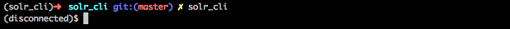
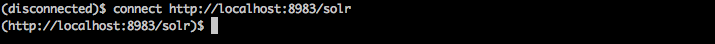
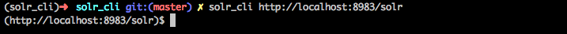
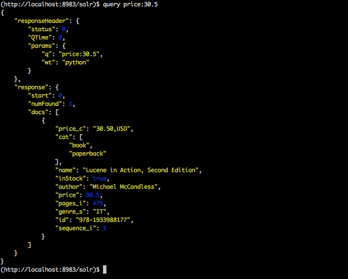
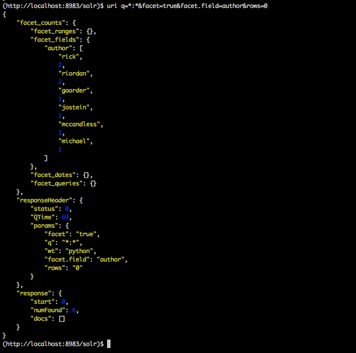
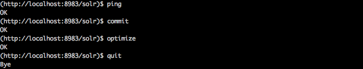

.. _userguide:

User guide
==========

Execution
---------

Just run 'solr_cli' in your shell.

You can type help in theconsole for listing all the allowed commands. And
if you want to see the help for and specific command you can type: ::

  help <command>

Connecting to solr
------------------

Once you are in the console you can connect to a solr server by using the
command connect followed by the solr server url. It doesn't open a real
connection it just checks if the server exits and is up.

Or you can connect by passing the solr server url as a parameter of the 
program.

Querying to Solr
----------------

There are two commands for querying solr from solr_cli. The easier one is 
*query*

The second one is *uri* which you can specify all the requests paremeter you
want to customize your query. In this example we are faceting all the books
of the index:

Schema operations
-----------------

For now there are two commands related to the schema.xml:

- schema : Prints the whole file.
- fields : Prints all the allowed fields.

General operations
------------------

ping
....

Checks if the solr server is up. 'OK' is printed if so.

commit
......

Sends a commit to the solr server.

optimize
........

Sends optimize operation to solr server.

quit/exit
.........

Exits from solr_cli.

Example of the execution of these commands:

